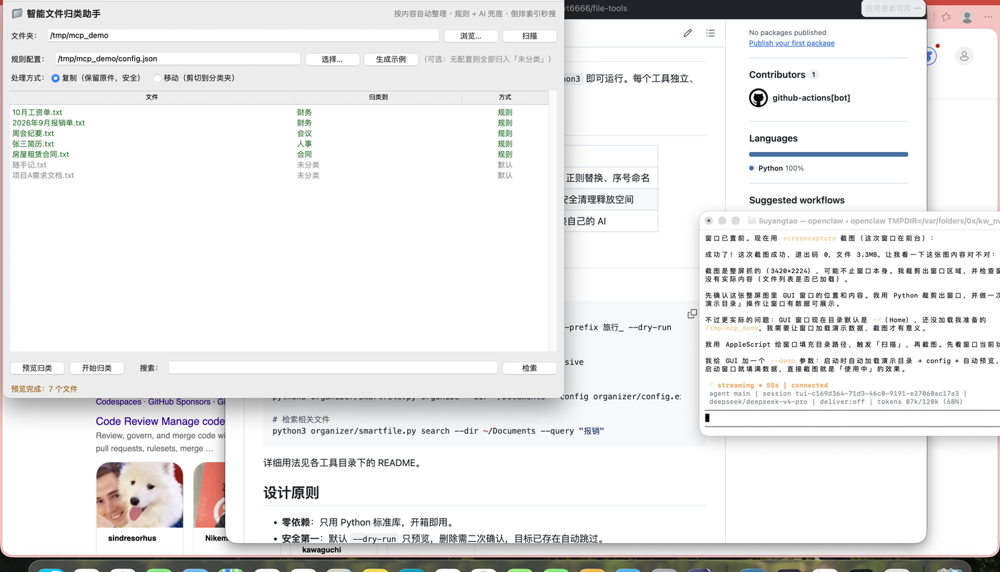

# smartfile — 智能文件归类 + 语义检索助手

根据文件**内容**自动归类、建立索引、关联检索。核心是「用你自己的习惯分类」：通过配置文件自定义分类规则，再交给可插拔的 AI（本地 Ollama 或 DeepSeek/OpenAI 兼容 API）做兜底判断。

> 💡 不用记命令——有现代化的图形界面，双击即用。见下方截图。

## ✨ 特点

- 🎨 **现代深色界面**（PySide6/Qt，支持浅色一键切换），双击即用
- 📄 按**内容**（不是扩展名）归类，比按后缀分类更聪明
- 🧠 **规则优先 + AI 兜底**：没配 AI 也能用，配了 AI 更准
- ⚡ **倒排索引 + BM25** 检索：海量文件毫秒级查相关文件
- 🔌 可插拔 AI：本地 Ollama（免费离线）或 DeepSeek/OpenAI 兼容 API
- 🛡 默认 `copy` 不破坏原文件，目标已存在自动跳过
- 📋 支持 txt / md / csv / log / json / pdf / docx 等格式

## 工作原理

**归类三段式**（见下文「分类优先级」）：

```
文件内容 ──→ ① 规则匹配（自定义关键词）──命中──→ 归类 ✓
                          │未命中
                          ▼
            ② AI 兜底（语义判断）──可用且命中──→ 归类 ✓
                          │不可用/失败
                          ▼
                  ③ 默认归类到「未分类」
```

**检索为什么快**（倒排索引 + BM25）：

普通做法是「把每个文件和查询词逐字比对」，文件一多就慢。smartfile 改用**倒排索引**：建索引时就把「每个词出现在哪些文件」预先存成一张表（倒排表），检索时直接查表定位候选文件，再对候选文件用 **BM25** 打分（词频 × 逆文档频率，越罕见的词命中越有价值），按相关度排序。

- 中文分词：单字 + 双字 bigram（不依赖重型分词库）
- 英文分词：按单词
- 500 个文件建索引约 0.24 秒，检索毫秒级

## 图形界面（推荐新手）

双击 `.app` 或运行 `python3 smartfile_gui.py` 打开窗口，无需记命令。界面基于 **PySide6**（Qt），深色现代风格，支持浅色切换：

<p align="center">
  
</p>

**安装依赖**：
```bash
pip install PySide6
```

**GUI 操作流程**：
1. 点「浏览…」选要整理的文件夹，点「扫描」
2. 没配置规则时，点「生成示例」一键生成分类规则（或点「选择…」加载你自己的 config.json）
3. 点「预览归类」→ 表格显示每个文件会被归到哪（绿色=规则命中，紫色=AI 判定，灰色=默认）
4. 确认无误点「开始归类」（默认「复制」保留原件，可切换「移动」）
5. 底部搜索框可检索相关文件（倒排索引 + BM25，海量文件毫秒级）

双击表格里的文件行可直接打开该文件。

---

## 两大能力

1. **organize** — 按内容归类：规则优先 + AI 兜底，把文件归档到对应文件夹
2. **search** — 检索：列出与查询相关的文件（关键词 + AI 语义检索）

## 特性

- ✅ 按**内容**（不是扩展名）归类
- ✅ 用户**自定义分类规则**（每类给关键词 + 目标文件夹）
- ✅ 可插拔 AI：本地 Ollama（免费离线）或 OpenAI/DeepSeek 兼容 API
- ✅ 支持 txt/md/csv/log/json/pdf(需 pypdf)/docx 等格式
- ✅ 建立本地索引，支持检索「相关文件」
- ✅ 全程 `--dry-run` 预览，`copy` 模式默认不破坏原文件
- ✅ 零第三方硬依赖（AI 调用用标准库 urllib，无需 pip）

## 快速开始

### 1. 写配置文件

复制模板并改成你自己的分类习惯：

```bash
cp config.example.json config.json
```

编辑 `config.json`，定义你的分类（每类一个 `name`、`folder`、`keywords` 列表）：

```json
{
  "ai": {
    "provider": "ollama",
    "ollama": { "base_url": "http://localhost:11434", "model": "qwen2.5:7b" }
  },
  "categories": [
    { "name": "财务报销", "folder": "财务", "keywords": ["发票", "报销", "账单", "金额"] },
    { "name": "合同协议", "folder": "合同", "keywords": ["合同", "甲方", "乙方", "签署"] }
  ],
  "default_folder": "未分类",
  "action": "copy"
}
```

### 2. 归类（先预览）

```bash
python3 smartfile.py organize --dir ~/Documents --config config.json --dry-run
python3 smartfile.py organize --dir ~/Documents --config config.json
```

### 3. 检索相关文件

```bash
python3 smartfile.py search --dir ~/Documents --query "上个月的报销"
```

## AI 配置（可选）

**不配 AI 也能用**——纯靠自定义关键词规则归类，我称之为「规则优先」。AI 只对规则没匹配到、但有内容的文件做兜底判断，并支持语义检索。

- **本地 Ollama（免费离线）**：装好 Ollama 后 `provider: "ollama"`，填型号即可。
- **云端 API（DeepSeek/OpenAI 兼容）**：`provider` 改成 `"openai"`，填 `base_url`、`api_key`、`model`。

## 完整命令

```
organize  按内容归类
  --dir DIR          目标目录
  --config FILE      配置文件（必填）
  --dry-run          只预览

search  检索相关文件
  --dir DIR          目标目录
  --query "关键词"    查询词
  --config FILE      配置文件（可选，用于 AI 语义检索）

index  重建索引
  --dir DIR
  --config FILE
```

## 分类优先级

1. **规则**：文件内容命中某类的 `keywords` → 归到该类
2. **AI 兜底**：规则没命中 + 文件有内容 + AI 可用 → AI 从全部类别里选一个
3. **默认**：以上都失败 → 归到 `default_folder`

## 设计原则

- **规则优先，AI 兜底**：没有 AI 也能用，有 AI 更聪明。
- **不破坏原文件**：默认 `copy`（复制），改 `action: "move"` 才移动。
- **目标已存在自动跳过**，绝不覆盖。

## License

MIT
